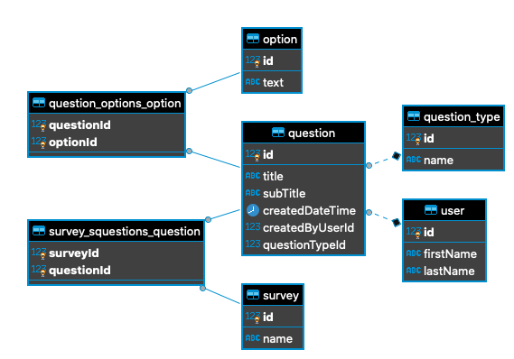

# Compass Surveys

This is a full stack Typescript application using GraphQL (client) and React (sever).

The project repo primarily consists of `client` and `server` folders. 
Please refer to the README.md on each folder for running on your local development machine.

Both folders have common scripts for running and testing.
- `npm start`
- `npm test`

### Local Development Requirements
- Node version 10.14+ onwards

Sqlite has been used as a db but should also work with Postgres (that was developed initially with) by just setting the `type` key in `server/ormconfig.json` to `postgres`

### ER Diagram

